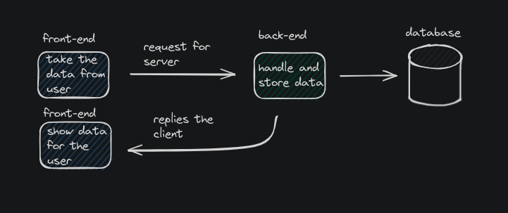

# Idempotency

I think this topic is very interesting because you need it for develop better api's. 

## Why?

I think this topic is very interesting because you need it for develop better api's. Let's think on a restaurant system, the client could create an order, the way the system will manage the order would be like this:



It's the happy way, but now imagine with the server create the order but the response fail(it can happening for N reasons), and the user click again on the button to create the order, it's send again to the server, and the server return the response correctly this time. But wait, ohh noo what happend we create two orders in the database, but the client thinks he make only one order, because things like this you should implement idempotency in your api.

## Install

Dependencies:
- golang
- make

After sure you have all the dependencies installed let's install the app and run it:

1. Open your terminal and paste the command `git clone https://github.com/nothiaki/idempotency.git`
2. Enter the directory, `cd idempotency`
3. run `make`

## Docs

| ROUTE           | DESCRIPTION                                           |
|-----------------|-------------------------------------------------------|
| GET /orders     | list of all orders in database [details](#get-orders) |
| GET /orders/:id | specific order [details](#get-orders-id)              |
| POST /orders    | create an order [details](#post-orders)               |

<h3 id="get-orders">GET /orders</h3>

status: 200
```json
[
  {
    "id": 0,
    "idempotency_id": "uuid",
    "name": "pizza",
    "price": 10.9
  },...
]
```

<h3 id="get-orders-id">GET /orders/:id</h3>

status: 200
```json
{
  "id": 0,
  "idempotency_id": "598cd438-9044-403f-85f0-9cb5cd9c3a25",
  "name": "pizza",
  "price": 10.9
}
```

<h3 id="post-orders">POST /orders</h3>

header: Idempotency-Id : pass an uuid

```json
{
  "name": "pizza",
  "price": 10.9
}
```

status: 201
```json
{
  "id": 0,
  "idempotency_id": "uuid",
  "name": "pizza",
  "price": 10.9
}
```
